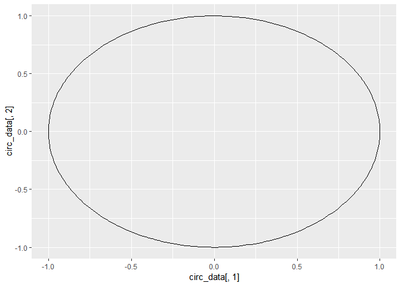

-   First post will discuss theory and discuss a simple problem
-   Second post will discuss manual and builtin implementation
-   Third post will reproduce Abdi's paper.

Principal Component Analysis (PCA) is one of the most popular
dimensionality reduction techniques. Though its origin dates back to
early 19th century, it has never gone out of fashion it seems. Its
popularity grows steady as can be gaugesd by the number of papers and
articles published related to PCA or its variants.

All popular programming platforms contain built in functions that
perform PCA given a data matrix. In this blog we will use the open
source statistical programming enviroment R to demonstrate the result.

We will also show how we can obtain the results using simple matrix
operations without using the builtin function.

In this blog we will reproduce using R all the results of an immensely
popular paper on PCA by Abdi et. al. The paper got published in 2010 and
within 8 years it has got close to 3800 citations. The data will be
taken from the paper itself.

    library(ggplot2)

    x = seq(0,2*pi,length.out = 300)
    a = cos(x);b = sin(x)
    circ_data = data.frame(a,b)
    #ggplot(circ_data,aes(circ_data[,1],circ_data[,2]))+geom_path()

    ggplot()+geom_path(data = circ_data,aes(circ_data[,1],circ_data[,2]))

      # geom_point(data = as.data.frame(pca$rotation),aes(x = pca$rotation[,1],y = pca$rotation[,2]),col = "red")+geom_text_repel()

We will breifly state the theory from the paper with slight modification
of notation. We will use conventional linear algebra notations against
those used in the paper for matrix factorizations.
