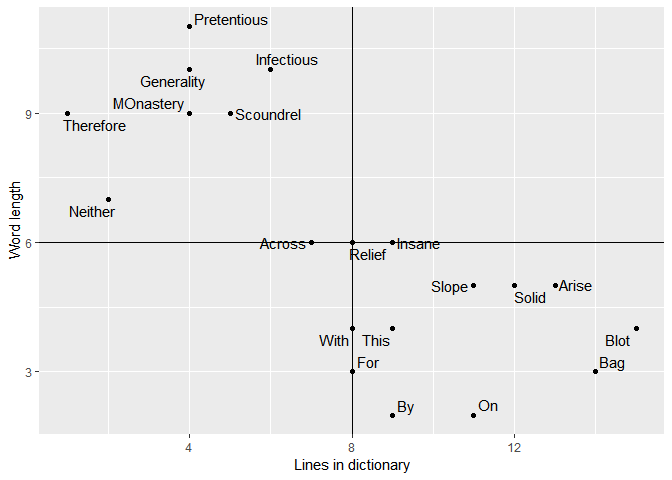
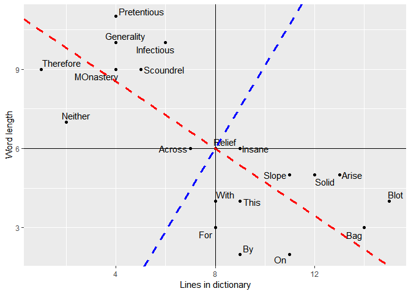
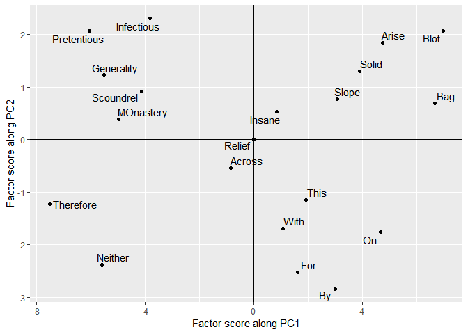
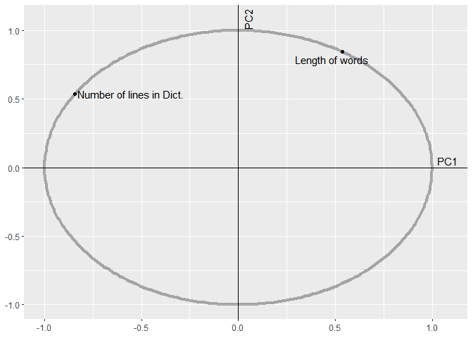
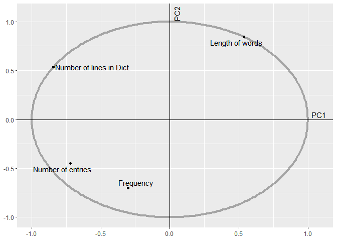
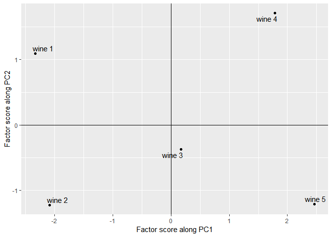
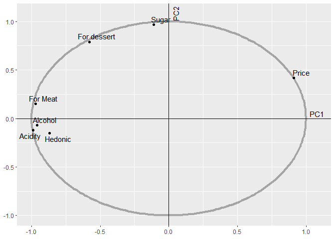
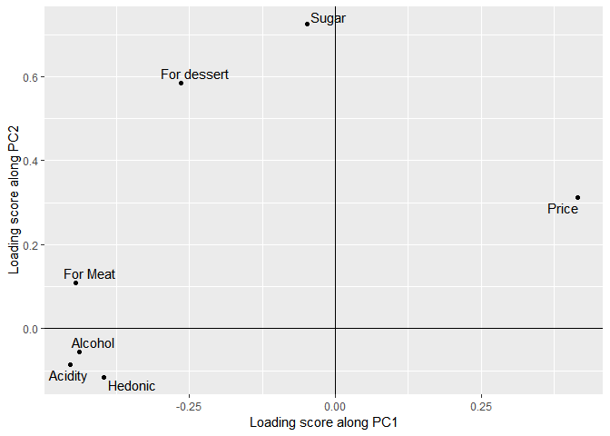
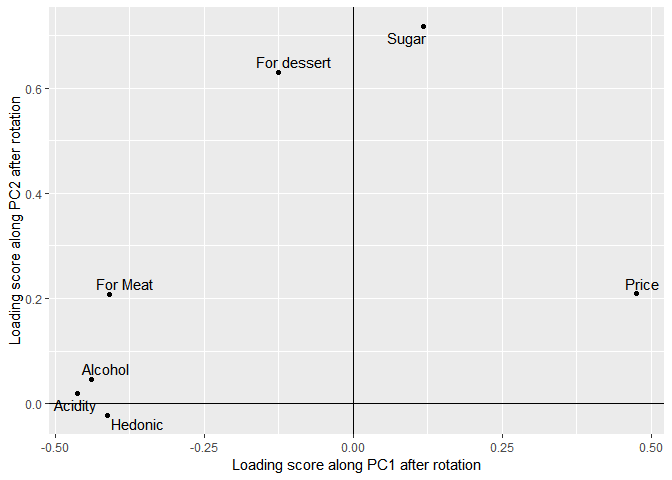
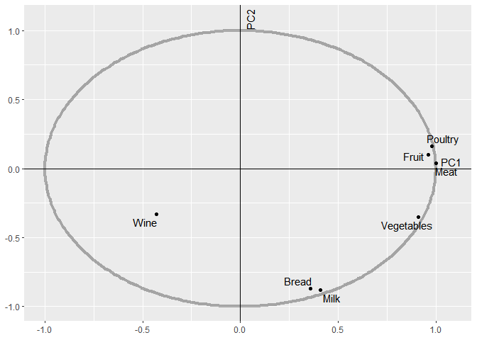

This post is Part-III of a three part series post on PCA. Other parts of
the series can be found at the links below.

-   [Part-I: Basic Theory of
    PCA](https://biswajitsahoo1111.wordpress.com/2018/12/28/principal-component-analysis---part-i/)
-   [Part-II: PCA Implementation with and without using built-in
    functions](https://biswajitsahoo1111.wordpress.com/2018/12/28/principal-component-analysis---part-ii/)

In this post, we will reproduce the results of a popular paper on PCA.
The paper is titled 'Principal component analysis' and is authored by
Herve Abdi and Lynne J. Williams. This paper got published in 2010 and
since then its popularity has only grown. The paper has been cited 3800+
times as per Google scholar data.

This post contains code snippets in R. Equivalent [MATLAB
codes](https://github.com/biswajitsahoo1111/PCA/blob/master/pca_part_II_MATLAB_codes.pdf)
can be obtained by using commands of
[Part-II](https://biswajitsahoo1111.wordpress.com/2018/12/28/principal-component-analysis---part-ii/).
For figures, the reader has to write his/her own code in MATLAB.

Structure of the paper
======================

Along with basic theory the paper contains three examples on PCA, one
example on correspondence analysis and one example on multiple factor
analysis. In this post we will only focus on PCA examples.

Data for the examples have been taken from the paper \[1\]. To get the
original source of the data, refer to the paper.

To run following R codes seamlessly, readers have to load following
three packages. If these packages have not been installed previously use
'install.packages("package\_name")' to install those.
```
    library(ggplot2)
    library(ggrepel)
    library(raster)
```
    ## Loading required package: sp
```
    # Table 1
    # Load data
    (words = read.csv("pca_abdi_words.csv",header = T))
```
    ##          Words Word_length Lines_in_dict
    ## 1          Bag           3            14
    ## 2       Across           6             7
    ## 3           On           2            11
    ## 4       Insane           6             9
    ## 5           By           2             9
    ## 6    MOnastery           9             4
    ## 7       Relief           6             8
    ## 8        Slope           5            11
    ## 9    Scoundrel           9             5
    ## 10        With           4             8
    ## 11     Neither           7             2
    ## 12 Pretentious          11             4
    ## 13       Solid           5            12
    ## 14        This           4             9
    ## 15         For           3             8
    ## 16   Therefore           9             1
    ## 17  Generality          10             4
    ## 18       Arise           5            13
    ## 19        Blot           4            15
    ## 20  Infectious          10             6
```
    (words_centered = scale(words[,2:3],scale = F)) # Removing the first column
```
    ##       Word_length Lines_in_dict
    ##  [1,]          -3             6
    ##  [2,]           0            -1
    ##  [3,]          -4             3
    ##  [4,]           0             1
    ##  [5,]          -4             1
    ##  [6,]           3            -4
    ##  [7,]           0             0
    ##  [8,]          -1             3
    ##  [9,]           3            -3
    ## [10,]          -2             0
    ## [11,]           1            -6
    ## [12,]           5            -4
    ## [13,]          -1             4
    ## [14,]          -2             1
    ## [15,]          -3             0
    ## [16,]           3            -7
    ## [17,]           4            -4
    ## [18,]          -1             5
    ## [19,]          -2             7
    ## [20,]           4            -2
    ## attr(,"scaled:center")
    ##   Word_length Lines_in_dict 
    ##             6             8
```
    pca_words_cov = prcomp(words[,2:3],scale = F) # cov stands for Covariance PCA
    factor_scores_words = pca_words_cov$x
    round(factor_scores_words,2)# Observer that factor scores for PC1 are negatives of what has been given in the paper. This is not a problem as it is negative of the direction given in the paper. It can also be checked that both the principal components are orthogonal.
```
    ##         PC1   PC2
    ##  [1,] -6.67  0.69
    ##  [2,]  0.84 -0.54
    ##  [3,] -4.68 -1.76
    ##  [4,] -0.84  0.54
    ##  [5,] -2.99 -2.84
    ##  [6,]  4.99  0.38
    ##  [7,]  0.00  0.00
    ##  [8,] -3.07  0.77
    ##  [9,]  4.14  0.92
    ## [10,] -1.07 -1.69
    ## [11,]  5.60 -2.38
    ## [12,]  6.06  2.07
    ## [13,] -3.91  1.30
    ## [14,] -1.92 -1.15
    ## [15,] -1.61 -2.53
    ## [16,]  7.52 -1.23
    ## [17,]  5.52  1.23
    ## [18,] -4.76  1.84
    ## [19,] -6.98  2.07
    ## [20,]  3.83  2.30
```
    sum(factor_scores_words[,1]*factor_scores_words[,2]) # PCs are orthogonal
```
    ## [1] -4.773959e-15
```
    # Contibution of each factor (It is defined as square of factor score divided by sum of squares of factor scores in that column)
    round(factor_scores_words[,1]^2/sum(factor_scores_words[,1]^2)*100,2)
```
    ##  [1] 11.36  0.18  5.58  0.18  2.28  6.34  0.00  2.40  4.38  0.29  8.00
    ## [12]  9.37  3.90  0.94  0.66 14.41  7.78  5.77 12.43  3.75
```
    round(factor_scores_words[,2]^2/sum(factor_scores_words[,2]^2)*100,2)
```
    ##  [1]  0.92  0.55  5.98  0.55 15.49  0.28  0.00  1.13  1.63  5.48 10.87
    ## [12]  8.25  3.27  2.55 12.32  2.90  2.90  6.52  8.25 10.18
```
    # The calculations in above two lines can be done in a single line
    round(factor_scores_words^2/matrix(rep(colSums(factor_scores_words^2),nrow(words)),ncol = 2,byrow = T)*100,2)
```
    ##         PC1   PC2
    ##  [1,] 11.36  0.92
    ##  [2,]  0.18  0.55
    ##  [3,]  5.58  5.98
    ##  [4,]  0.18  0.55
    ##  [5,]  2.28 15.49
    ##  [6,]  6.34  0.28
    ##  [7,]  0.00  0.00
    ##  [8,]  2.40  1.13
    ##  [9,]  4.38  1.63
    ## [10,]  0.29  5.48
    ## [11,]  8.00 10.87
    ## [12,]  9.37  8.25
    ## [13,]  3.90  3.27
    ## [14,]  0.94  2.55
    ## [15,]  0.66 12.32
    ## [16,] 14.41  2.90
    ## [17,]  7.78  2.90
    ## [18,]  5.77  6.52
    ## [19,] 12.43  8.25
    ## [20,]  3.75 10.18
```
    # Squared distance to center of gravity
    (dist = rowSums(factor_scores_words^2))
```
    ##  [1] 45  1 25  1 17 25  0 10 18  4 37 41 17  5  9 58 32 26 53 20
```
    # Ssquared cosine of observations of first PC
    (sq_cos = round(factor_scores_words^2/rowSums(factor_scores_words^2)*100))
```
    ##       PC1 PC2
    ##  [1,]  99   1
    ##  [2,]  71  29
    ##  [3,]  88  12
    ##  [4,]  71  29
    ##  [5,]  53  47
    ##  [6,]  99   1
    ##  [7,] NaN NaN
    ##  [8,]  94   6
    ##  [9,]  95   5
    ## [10,]  29  71
    ## [11,]  85  15
    ## [12,]  90  10
    ## [13,]  90  10
    ## [14,]  74  26
    ## [15,]  29  71
    ## [16,]  97   3
    ## [17,]  95   5
    ## [18,]  87  13
    ## [19,]  92   8
    ## [20,]  74  26

Nan's are produced because of division by zero.
```
    # Figue 1
    p = ggplot(words,aes(x = Lines_in_dict,y = Word_length,label = Words))+
      geom_point()+ geom_text_repel()+ 
      geom_hline(yintercept = 6)+geom_vline(xintercept = 8)+
      labs(x = "Lines in dictionary",y = "Word length")
    print(p)
```

```
    # Show directions of PCs
    # Note that intercept argument in geom_abline considers the line to be at the origin. In our case the data are mean shifted.
    # So we have to adjust the intercept taking new origin into consideration. These adjustments have been made below.
    slope1 = pca_words_cov$rotation[1,1]/pca_words_cov$rotation[2,1] # Slope of first PC
    slope2 = pca_words_cov$rotation[1,2]/pca_words_cov$rotation[2,2] # Slope of second PC
    (new_origin = c(mean(words$Lines_in_dict),mean(words$Word_length)))
```
    ## [1] 8 6
```
    intercept1 = 6 - slope1*8
    intercept2 = 6 - slope2*8
    p+geom_abline(slope = slope1,intercept = intercept1,linetype = "dashed",size = 1.2,col = "red")+
      geom_abline(slope = slope2,intercept = intercept2,linetype = "dashed",size = 1.2,col = "blue")
```
 In
the above figure red dashed line is the 1st principal component (PC) and
blue dashed line is the 2nd PC.
```
    # Rotated PCs
    # This figure is obtained by plotting facotor scores. Note that we will plot negative of the factor scores of 1st PC to make the figure consistent with the paper.
    ggplot(as.data.frame(pca_words_cov$x),aes(-pca_words_cov$x[,1],pca_words_cov$x[,2],label = words$Words))+
      geom_point()+geom_text_repel()+geom_hline(yintercept = 0)+geom_vline(xintercept = 0)+
      xlab("Factor score along PC1")+ylab("Factor score along PC2")
```
 Given
a supplementary point (a point previously not used in finding principal
components),we have to first center the data point. Its factor scores
can then be obtained by multiplying it with the loading matrix.
```
    # Finding factor score of a new point
    sur = c(3,12) # It has 3 letter and 12 lines of dictionary entry
    (sur_centered = sur - colMeans(words[,2:3]))
```
    ##   Word_length Lines_in_dict 
    ##            -3             4
```
    (factor_scores_sur = round(sur_centered %*% pca_words_cov$rotation,2))
```
    ##        PC1   PC2
    ## [1,] -4.99 -0.38

### Eigenvalues and variance

See
[Part-II](https://biswajitsahoo1111.wordpress.com/2018/12/28/principal-component-analysis---part-ii/)
for details. Total variance before transformation
```
    (total_var_before = round(sum(diag(var(words_centered))),3))
```
    ## [1] 23.368
```
    (total_var_after = round(sum(diag(var(pca_words_cov$x))),3))
```
    ## [1] 23.368

Correlation between principal components and original variables (In the
paper,this correlation is also termed loading. But we will strictly
reserve the loading term to mean loading matrix **P** (see
[Part-I](https://biswajitsahoo1111.wordpress.com/2018/12/28/principal-component-analysis---part-i/))

The sum of correlation coefficients between variables and principal
components is 1. Intuitively, this means that variables are orthogonally
projected onto the principal components.
```
    # Correlation between PCs and original variables
    (cor(pca_words_cov$x,words_centered))
```
    ##     Word_length Lines_in_dict
    ## PC1   0.8679026    -0.9741764
    ## PC2   0.4967344     0.2257884

**Note** that the answers for correlation coefficients don't match with
that of the paper. Readers who get actual answers as given in paper are
encouraged to comment below the post. However our procedure is correct
and it does indeed give the correct answer for supplementary data as
described below.
```
    # Squared correaltion
    (cor(pca_words_cov$x,words_centered)^2)
```
    ##     Word_length Lines_in_dict
    ## PC1   0.7532549    0.94901961
    ## PC2   0.2467451    0.05098039
```
    # sum of correlation coefficients between variables and principal components is 1
    colSums((cor(pca_words_cov$x,words_centered)^2))
```
    ##   Word_length Lines_in_dict 
    ##             1             1
```
    (loading_matrix = pca_words_cov$rotation)
```
    ##                      PC1       PC2
    ## Word_length    0.5368755 0.8436615
    ## Lines_in_dict -0.8436615 0.5368755

Correlation score for supplementary variable
```
    # Supplementary variable (Table 4)
    Frequency = c(8,230,700,1,500,1,9,2,1,700,7,1,4,500,900,3,1,10,1,1)
    Num_entries = c(6,3,12,2,7,1,1,6,1,5,2,1,5,9,7,1,1,4,4,2)
    supp_data = data.frame(Frequency,Num_entries) # Supplementary data
    # Table 5
    supp_data_cent = scale(supp_data,scale = F) # Centered supplementary data
    (corr_score_supp = round(cor(pca_words_cov$x,supp_data),4))
```
    ##     Frequency Num_entries
    ## PC1   -0.3012     -0.6999
    ## PC2   -0.7218     -0.4493
```
    # Note that correlation doesn't depent on whether supplementary data is centered or not.
    (round(cor(pca_words_cov$x,supp_data_cent),4))
```
    ##     Frequency Num_entries
    ## PC1   -0.3012     -0.6999
    ## PC2   -0.7218     -0.4493
```
    # Squared correlation
    (round(cor(pca_words_cov$x,supp_data_cent)^2,4))
```
    ##     Frequency Num_entries
    ## PC1    0.0907      0.4899
    ## PC2    0.5210      0.2019
```
    (round(colSums(cor(pca_words_cov$x,supp_data_cent)^2),4))
```
    ##   Frequency Num_entries 
    ##      0.6118      0.6918

Correlation circle plot
```
    # First plot correlation circle
    x = seq(0,2*pi,length.out = 300)
    circle = ggplot() + geom_path(data = data.frame(a = cos(x),b = sin(x)),
                         aes(cos(x),sin(x)),alpha = 0.3, size = 1.5)+
                geom_hline(yintercept = 0)+geom_vline(xintercept = 0)+
      annotate("text",x = c(1.08,0.05),y = c(0.05,1.08),label = c("PC1","PC2"),angle = c(0,90))+
                xlab(NULL)+ylab(NULL)
    # Plotting original variables
    variable_plot_original = circle + geom_point(data = as.data.frame(pca_words_cov$rotation),
                          aes(pca_words_cov$rotation[,1],pca_words_cov$rotation[,2]))+
      geom_text_repel(aes(pca_words_cov$rotation[,1],pca_words_cov$rotation[,2],
                          label = c("Length of words","Number of lines in Dict."))) 
    print(variable_plot_original)
```

```
    # Plotting supplementary variables
    variable_plot_original+
      geom_point(data = as.data.frame(corr_score_supp),
                 aes(corr_score_supp[,1],corr_score_supp[,2]))+
      geom_text_repel(aes(corr_score_supp[,1],corr_score_supp[,2],
                          label = c("Frequency","Number of entries"))) 
```


Example 2
=========

### Wine example
```
    # Correlation PCA using wine data 
    # Table 6
    (wine = read.csv("pca_abdi_wine.csv",header = T))
```
    ##   wine_type hedonic for_meat for_dessert price sugar alcohol acidity
    ## 1    wine_1      14        7           8     7     7      13       7
    ## 2    wine_2      10        7           6     4     3      14       7
    ## 3    wine_3       8        5           5    10     5      12       5
    ## 4    wine_4       2        4           7    16     7      11       3
    ## 5    wine_5       6        2           4    13     3      10       3
```
    pca_wine_cor = prcomp(wine[2:8],scale = T)
    ggplot(as.data.frame(pca_wine_cor$x),aes(x = pca_wine_cor$x[,1],y =  pca_wine_cor$x[,2], label = paste0("wine ",1:5)))+
      geom_point()+geom_text_repel()+ geom_vline(xintercept = 0)+ geom_hline(yintercept = 0)+
      xlab("Factor score along PC1")+ylab("Factor score along PC2")
```


Again our figure seems upside down than that of the paper. This is a
minor discrepancy. Our 2nd eigen vector is negative of the one
considered in paper. We can match the plot with that of the paper by
just flipping the second principal component but we will not do that
here.
```
    # Table 7
    # Factor scores along 1st and 2nd PC
    (pca_wine_cor$x[,1:2])
```
    ##             PC1       PC2
    ## [1,] -2.3301649  1.095284
    ## [2,] -2.0842419 -1.223185
    ## [3,]  0.1673228 -0.370258
    ## [4,]  1.7842392  1.712563
    ## [5,]  2.4628448 -1.214405
```
    # Contibution of each observation to principal component
    round(pca_wine_cor$x[,1:2]^2/matrix(rep(colSums(pca_wine_cor$x[,1:2]^2),nrow(wine)),ncol = 2,byrow = T)*100,2)
```
    ##        PC1   PC2
    ## [1,] 28.50 16.57
    ## [2,] 22.80 20.66
    ## [3,]  0.15  1.89
    ## [4,] 16.71 40.51
    ## [5,] 31.84 20.37
```
    # Squared cosine of observations of first PC
    (sq_cos = round(pca_wine_cor$x[,1:2]^2/rowSums(pca_wine_cor$x^2)*100))
```
    ##      PC1 PC2
    ## [1,]  77  17
    ## [2,]  69  24
    ## [3,]   7  34
    ## [4,]  50  46
    ## [5,]  78  19
```
    # Loading scores corresponding to first two principal components
    (round(pca_wine_cor$rotation[,1:2],2))
```
    ##               PC1   PC2
    ## hedonic     -0.40 -0.11
    ## for_meat    -0.45  0.11
    ## for_dessert -0.26  0.59
    ## price        0.42  0.31
    ## sugar       -0.05  0.72
    ## alcohol     -0.44 -0.06
    ## acidity     -0.45 -0.09
```
    # Correlation score variables with first two principal compoents
    (corr_score_wine = round(cor(pca_wine_cor$x,wine[,2:8])[1:2,],2))
```
    ##     hedonic for_meat for_dessert price sugar alcohol acidity
    ## PC1   -0.87    -0.97       -0.58  0.91 -0.11   -0.96   -0.99
    ## PC2   -0.15     0.15        0.79  0.42  0.97   -0.07   -0.12
```
    # Correlation circle for wine data
    # Figure 6
    corr_score_wine = t(corr_score_wine)
    circle + 
      geom_point(data = as.data.frame(corr_score_wine),
                 aes(corr_score_wine[,1],corr_score_wine[,2]))+
      geom_text_repel(aes(corr_score_wine[,1],corr_score_wine[,2],
                          label = c("Hedonic","For Meat","For dessert","Price","Sugar","Alcohol","Acidity")))
```


### Varimax rotation

Rotation is applied to loading matrix such that after rotation principal
components are interpretable. By interpretable, we mean, some of the
loading scores will have higher values and some other loading scores
will have lower values. So it can be said that the variables whose
loading scores have higher value, contribute significantly towards
principal components as compared to other variables with lesser loading
scores. Though rotation works in certain cases, it must be remembered
that it is no magic wand for principal component interpretability. One
of the popular rotations is Varimax rotation. R has a built-in command
to perform varimax rotation.

Varimax rotation can be performed on the whole loading matrix or on a
few components only. In the paper, varimax has been applied to first two
principal components.
```
    # Loading scores of first two principal components
    (round(pca_wine_cor$rotation[,1:2],2))
```
    ##               PC1   PC2
    ## hedonic     -0.40 -0.11
    ## for_meat    -0.45  0.11
    ## for_dessert -0.26  0.59
    ## price        0.42  0.31
    ## sugar       -0.05  0.72
    ## alcohol     -0.44 -0.06
    ## acidity     -0.45 -0.09
```
    # Varimax applied to first two principal components
    rotated_loading_scores = varimax(pca_wine_cor$rotation[,1:2])
    # Loading scores after rotation (Table 10)
    (round(rotated_loading_scores$loadings[,1:2],2))
```
    ##               PC1   PC2
    ## hedonic     -0.41 -0.02
    ## for_meat    -0.41  0.21
    ## for_dessert -0.12  0.63
    ## price        0.48  0.21
    ## sugar        0.12  0.72
    ## alcohol     -0.44  0.05
    ## acidity     -0.46  0.02
```
    # The same result can also be obtained by mulitplying the original loading 
    # matrix by the rotation matrix obtained from varimax
    (round(pca_wine_cor$rotation[,1:2] %*% rotated_loading_scores$rotmat,2))
```
    ##              [,1]  [,2]
    ## hedonic     -0.41 -0.02
    ## for_meat    -0.41  0.21
    ## for_dessert -0.12  0.63
    ## price        0.48  0.21
    ## sugar        0.12  0.72
    ## alcohol     -0.44  0.05
    ## acidity     -0.46  0.02
```
    #Figure 7
    # Plot of loading socres before rotation
    ggplot(as.data.frame(pca_wine_cor$rotation[,1:2]),aes(x = pca_wine_cor$rotation[,1],y = pca_wine_cor$rotation[,2],
                                                          label = c("Hedonic","For Meat","For dessert","Price","Sugar","Alcohol","Acidity")))+
      geom_point()+geom_text_repel()+geom_hline(yintercept = 0)+geom_vline(xintercept = 0)+
      xlab("Loading score along PC1")+ylab("Loading score along PC2")
```

```
    # Plot of loading scores after rotation
    ggplot(as.data.frame(rotated_loading_scores$loadings[,1:2]),
                         aes(x = rotated_loading_scores$loadings[,1],
                             y = rotated_loading_scores$loadings[,2],
                             label = c("Hedonic","For Meat","For dessert","Price","Sugar","Alcohol","Acidity")))+
      geom_point()+geom_text_repel()+geom_hline(yintercept = 0)+geom_vline(xintercept = 0)+
        xlab("Loading score along PC1 after rotation")+
        ylab("Loading score along PC2 after rotation")
```


Example 3
=========

### French food example (Covariance PCA example)
```
    # Load data (Table 11) 
    (food = read.csv("pca_abdi_food.csv",header = T))
```
    ##           class children bread vegetables fruit meat poultry milk wine
    ## 1   Blue_collar        2   332        428   354 1437     526  247  427
    ## 2  White_collar        2   293        559   388 1527     567  239  258
    ## 3   Upper_class        2   372        767   562 1948     927  235  433
    ## 4   Blue_collar        3   406        563   341 1507     544  324  407
    ## 5  White_collar        3   386        608   396 1501     558  319  363
    ## 6   Upper_class        3   438        843   689 2345    1148  243  341
    ## 7   Blue_collar        4   534        660   367 1620     638  414  407
    ## 8  White_collar        4   460        699   484 1856     762  400  416
    ## 9   Upper_class        4   385        789   621 2366    1149  304  282
    ## 10  Blue_collar        5   655        776   423 1848     759  495  486
    ## 11 White_collar        5   584        995   548 2056     893  518  319
    ## 12  Upper_class        5   515       1097   887 2630    1167  561  284
```
    pca_food_cov = prcomp(food[,3:9],scale = F)

    # Table 12
    # Factor scores
    (factor_scores_food = round(pca_food_cov$x[,1:2],2))
```
    ##           PC1     PC2
    ##  [1,] -635.05  120.89
    ##  [2,] -488.56  142.33
    ##  [3,]  112.03  139.75
    ##  [4,] -520.01  -12.05
    ##  [5,] -485.94   -1.17
    ##  [6,]  588.17  188.44
    ##  [7,] -333.95 -144.54
    ##  [8,]  -57.51  -42.86
    ##  [9,]  571.32  206.76
    ## [10,]  -39.38 -264.47
    ## [11,]  296.04 -235.92
    ## [12,]  992.83  -97.15
```
    # Contibution of each observation to principal component
    round(pca_food_cov$x[,1:2]^2/matrix(rep(colSums(pca_food_cov$x[,1:2]^2),nrow(food)),ncol = 2,byrow = T)*100,2)
```
    ##         PC1   PC2
    ##  [1,] 13.34  5.03
    ##  [2,]  7.90  6.97
    ##  [3,]  0.42  6.72
    ##  [4,]  8.94  0.05
    ##  [5,]  7.81  0.00
    ##  [6,] 11.44 12.22
    ##  [7,]  3.69  7.19
    ##  [8,]  0.11  0.63
    ##  [9,] 10.80 14.71
    ## [10,]  0.05 24.07
    ## [11,]  2.90 19.15
    ## [12,] 32.61  3.25
```
    dist = pca_food_cov$x[,1]^2+pca_food_cov$x[,2]^2
    # Squared cosine of observations of first PC (rowSums command from 'raster' pcakage has been used)
    (sq_cos = round(pca_food_cov$x[,1:2]^2/rowSums(pca_food_cov$x^2)*100))
```
    ##       PC1 PC2
    ##  [1,]  95   3
    ##  [2,]  86   7
    ##  [3,]  26  40
    ##  [4,] 100   0
    ##  [5,]  98   0
    ##  [6,]  89   9
    ##  [7,]  83  15
    ##  [8,]  40  22
    ##  [9,]  86  11
    ## [10,]   2  79
    ## [11,]  57  36
    ## [12,]  97   1
```
    # Table 13
    # squared loading score
    (round(pca_food_cov$rotation[,1:2]^2,2))
```
    ##             PC1  PC2
    ## bread      0.01 0.33
    ## vegetables 0.11 0.17
    ## fruit      0.09 0.01
    ## meat       0.57 0.01
    ## poultry    0.22 0.06
    ## milk       0.01 0.40
    ## wine       0.00 0.02

**Note** that this table doesn't match with that of the paper. We will
stick to our analysis.
```
    # Correlation score
    (corr_score_food = round((cor(pca_food_cov$x,food[,3:9])[1:2,]),2))
```
    ##     bread vegetables fruit meat poultry  milk  wine
    ## PC1  0.36       0.91  0.96 1.00    0.98  0.41 -0.43
    ## PC2 -0.87      -0.35  0.10 0.04    0.16 -0.88 -0.33
```
    # squared correlation score
    (round((cor(pca_food_cov$x,food[,3:9])[1:2,])^2,2))
```
    ##     bread vegetables fruit meat poultry milk wine
    ## PC1  0.13       0.83  0.92    1    0.96 0.17 0.18
    ## PC2  0.76       0.12  0.01    0    0.03 0.77 0.11
```
    # Figure 9
    # Correlation circle for food data
    corr_score_food = t(corr_score_food)
    circle + geom_point(data = as.data.frame(corr_score_food), 
                        aes(x = corr_score_food[,1],y = corr_score_food[,2]))+
      geom_text_repel(data = as.data.frame(corr_score_food), 
                      aes(x = corr_score_food[,1],y = corr_score_food[,2],
                          label = c("Bread","Vegetables","Fruit","Meat","Poultry","Milk","Wine")))
```
 Now
observe that our correlation circle plot is almost close to that of the
papers (though in opposite quadrants. But this is not a problem as we
have previously mentioned).
```
    ## Table 14
    cent_food = food[,3:9]-matrix(rep(colMeans(food[,3:9]),times = 12),nrow = 12,
                                  byrow = T)
    svd_food = svd(cent_food)
    # Eigenvalues
    (Eigenvalues = (svd_food$d)^2)
```
    ## [1] 3023141.2354  290575.8390   68795.2333   25298.9496   22992.2474
    ## [6]    3722.3214     723.9238

**Important Note:** These eigenvalues are not the same as variance of
factor scores in principal components. Variance of principal component
factor scores can be obtained by dividing the eigenvalues by (*n* − 1),
where *n* is number of data points (in this case *n* = 12). If this
point is still not clear, refer to Part-II.
```
    # Percentage contribution of each PC
    (round(Eigenvalues/sum(Eigenvalues),2))
```
    ## [1] 0.88 0.08 0.02 0.01 0.01 0.00 0.00
```
    # Cumulative sum of eigen values
    (round(cumsum(Eigenvalues),2))
```
    ## [1] 3023141 3313717 3382512 3407811 3430804 3434526 3435250
```
    # Cumulative percentage
    (round(cumsum(Eigenvalues)/sum(Eigenvalues),2))
```
    ## [1] 0.88 0.96 0.98 0.99 1.00 1.00 1.00
```
    # RESS (Refer to the paper for a description)
    RESS = array(rep(0,7))
    for (i in 1:7){
      RESS[i] = sum(Eigenvalues)-sum(Eigenvalues[1:i])
    }
    RESS
```
    ## [1] 412108.5146 121532.6756  52737.4423  27438.4927   4446.2453    723.9238
    ## [7]      0.0000
```
    # RESS/sum of eigenvalues
    round(RESS/sum(Eigenvalues),2)
```
    ## [1] 0.12 0.04 0.02 0.01 0.00 0.00 0.00

We have not calculated the value of PRESS in this post as it will
require us to consider random models. We will not pursue it here.

Though unusually long, I hope, this post will be of help to (courageous)
readers who work there way through till end. Please comment below if you
find any errors or omissions.

Reference
---------

1.  Abdi, H., & Williams, L. J. (2010). Principal component analysis.
    Wiley interdisciplinary reviews: computational statistics, 2(4),
    433-459.
